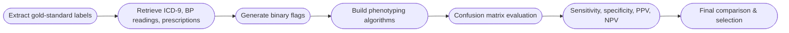

# Algorithm to Identify Patients with Hypertension

**This repository aims to document the algorithm developed to identify patients with hypertension, as part of Course 3 of Clinical Data Science course.**
It evaluates multiple rule-based approaches to find the best algorithm fit to identify patients with hypertension.

---

## 📌 Project Overview

Hypertension is a common and clinically significant condition, but identifying patients reliably in electronic health records (EHR) is complex. This project evaluates different **phenotyping strategies** to determine which data elements most accurately identify hypertensive patients.

The analysis compares:

- Diagnosis codes (ICD‑9)
- Antihypertensive prescriptions
- Repeated elevated blood pressure measurements
- Combination algorithms

Each of these methods are benchmarked and evaluated against a *gold-standard dataset for hypertension* as part of the **Clinical Data Science** course.

---

## Source & Tools

**Source data:** MIMIC-III demo data containing the anonymised data of 100 patients
- *DIAGNOSES_ICD* table
- *D_ANTIHYPERTENSIVES* table 

Goldstandard data table (*course3_data.hypertension_goldstandard*) from the Google BigQuery database of the **LearnClinicalDataScience** SQL server as part of the Clinical Data Science specialization course.

**Tools:**
- SQL - retrieving goldstandard datatable from the server
- RStudio - analytical environment for the algorithm development & testing 
- R Packages
 - Tidyverse
 - Magrittr
 - bigrquery
 - caret

**For further information, see the R script file within the repository containing the code used for the analysis & benchmarking.**

## 🎯 Questions

- How well do diagnosis codes, prescriptions, and vital signs independently identify hypertension?
- Does combining data sources improve accuracy?
- Which algorithm yields the best balance of sensitivity and specificity?
- Which method minimizes false negatives (missed hypertensive patients)?
- Which method best matches the gold‑standard classification?

---

## Data Analysis Workflow

### Algorithm Development Workflow

---

## 🧪 Methods Summary

### Tests Conducted
- Acute toxicity tests (48-hour exposure)
- Chronic toxicity tests (14-day exposure)
- Heart rate comparison analysis before and after exposure   

### Tools & Software
- Excel (Data management, EDA)
- RStudio (v4.0.5)
- Key R packages:
  - `ecotox` – LC_probit function for Median Lethal Concentration value calculation (LC10 & LC50)
  - `survival` – Kaplan–Meier analysis (Survival curves graphs)
  - `stats` – paired t‑tests, ANOVA, Kruskal–Wallis  
- Da Vinci Video Editor (Heart rate video footage editing & management)

### Toxicity Metrics
- **LC10 / LC50** values determined via probit regression  
- **MATC (Maximum Acceptable Toxicant Concentration)**  
- Comparative analysis of LC values using Ratio Tests  

### Heart Rate Analysis
- Paired t‑tests (before/after exposure)
- ANOVA or Kruskal–Wallis (between concentration groups)
- Inter‑group comparison of ABHS vs NABHS effects

---

## 📊 Data Analysis Workflow

1. Import and clean experimental datasets  
2. Conduct probit modelling for LC estimation  
3. Run survival analysis for chronic test groups  
4. Perform statistical significance tests for heart rate data  
5. Generate plots and visualisations  
6. Investigate inconsistent or non‑monotonic concentration–response results  

---

## 📈 Summary of Key Findings

*(Replace with your final findings once you add results.)*

- Alcohol evaporation significantly interfered with stable exposure concentrations.
- Several chronic toxicity trials produced inconsistent LC50 ordering; methodological artefacts were identified and analysed.
- NABHS showed clearer dose–response relationships than ABHS.
- Heart rate effects were statistically significant at several concentrations.

Detailed results can be found in the `/results` folder.
---

